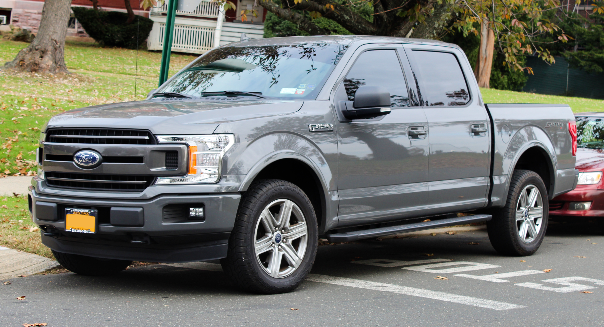

```{r setup, include=FALSE}
knitr::opts_chunk$set(echo = TRUE)
```

# ROGER WILLIAM TCHEGUI   


```{r pressure, echo=FALSE, fig.cap="", out.width = '30%',fig.align='left'}


```


# I'm from West Africa  a country call CAMERRON 

# I'm intered in Sports and like to spend time with family 

# I work at USWS as a field Engineer

# I did my undergraduate at Texas tech University and now attending SMU


^[The other tabs represent work / analyses that I have completed.  Please check themt!.]